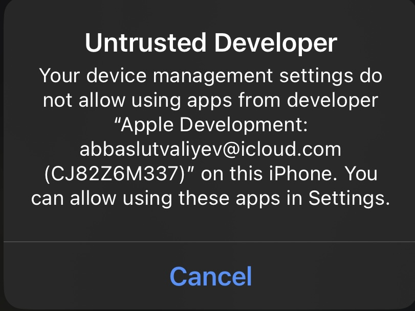

# Installation from PC
* Download any program to download iPA from PC to device.
* Then download the file from [this link](https://github.com/z3ven/iAlgoAz/releases/download/ialgoaz/release.ipa)
* In the program, select this file and install it on your phone
* If the following window appears:

then you need to go to Settings> General> VPN and device management> Select "Abbas Lutvaliyev Personal Team" and click Trust
* You can use the program
NOTE! THE APP CAN BE USED FOR ONLY 7 DAYS DUE TO APPLE LIMITATIONS, AFTER THIS PERIOD YOU NEED TO CARRY OUT THIS PROCEDURE AGAIN
