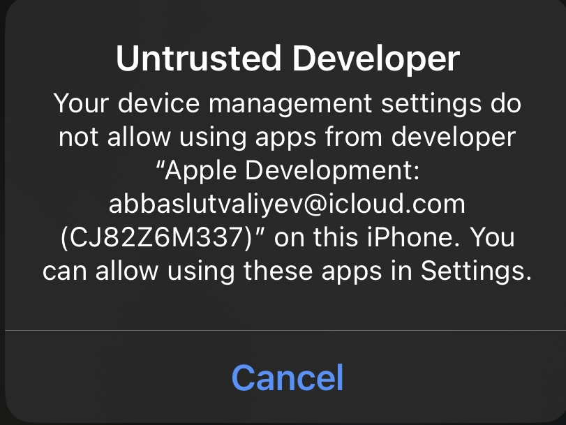

# Установка с ПК
* Скачайте любую программу для загрузки iPA с пк на устройство. 
* Затем скачайте файл по [этой ссылке](https://github.com/z3ven/iAlgoAz/releases/download/ialgoaz/release.ipa) 
* В программе выберете данный файл и установите на телефон
* Если появляется вот такое окно:

 

то нужно зайти в Настройки > Основные > VPN и управление устройством > Выбрать "Abbas Lutvaliyev Personal Team " и нажать Доверять 
* Можете пользоватся программой
ПРИМЕЧАНИЕ! ПРИЛОЖЕНИЕМ МОЖНО ПОЛЬЗОВАТСЯ ТОЛЬКО 7 ДНЕЙ ИЗЗА ОГРАНИЧЕНИЙ APPLE , ПОСЛЕ ДАННОГО ПЕРИОДА НУЖНО ОПЯТЬ ПРОВОДИТЬ ДАННУЮ ПРОЦЕДУРУ
